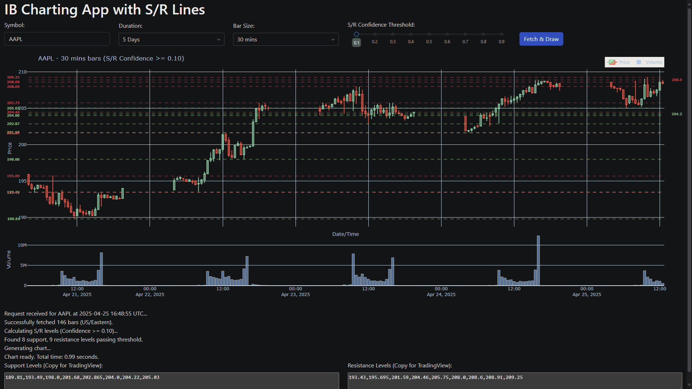

# IB Charting App with Automatic S/R Lines

A Python application using Dash and the Interactive Brokers TWS API (via `ib_insync`) to display interactive stock charts with automatically calculated and confidence-filtered Support and Resistance (S/R) levels.

## Demo



## Features

*   Connects to Interactive Brokers TWS or Gateway.
*   Fetches historical OHLCV data for stocks, including extended trading hours (pre/post-market).
*   Displays data on an interactive Plotly candlestick chart.
*   Automatically calculates potential Support and Resistance levels using peak/trough detection (`scipy.signal.find_peaks`).
*   Filters calculated S/R levels based on a confidence score (placeholder heuristic or future ML model).
*   Draws the filtered S/R lines on the chart.
*   Adds price labels for S/R lines next to the Y-axis, preventing overlap.
*   Visually removes weekend gaps from the chart's X-axis.
*   Web-based UI built with Dash and Dash Bootstrap Components.
*   User Controls:
    *   Stock Symbol Input
    *   History Duration Dropdown
    *   Bar Size Dropdown
    *   S/R Confidence Threshold Slider
*   **NEW:** Exports calculated S/R levels as CSV strings for easy import into TradingView.

## File Structure & Script Functions

*   **`app.py`**:
    *   Main Dash app: UI layout, callbacks, orchestrates data fetching, S/R calculation, charting, and **S/R level string export**.
*   **`ib_connector.py`**:
    *   Handles IB TWS/Gateway connection and data fetching.
*   **`data_manager.py`**:
    *   Manages price data (`pandas` DataFrame).
*   **`charting.py`**:
    *   Creates Plotly candlestick chart and adds S/R lines/annotations.
*   **`sr_calculator.py`**:
    *   Calculates and filters S/R levels.
*   **`config.py`**:
    *   Stores configuration settings.
*   **`requirements.txt`**:
    *   Lists Python dependencies.

## Setup

1.  **Prerequisites:**
    *   Python 3.8+
    *   Interactive Brokers account (Paper or Live)
    *   Interactive Brokers Trader Workstation (TWS) or IB Gateway installed and running.
2.  **Clone the repository:**
    ```bash
    git clone <your-repository-url>
    cd <your-repository-directory>
    ```
3.  **Install dependencies:**
    ```bash
    pip install -r requirements.txt
    ```
4.  **Configure TWS/Gateway API:**
    *   Ensure TWS/Gateway is running.
    *   Go to `File -> Global Configuration -> API -> Settings`.
    *   Check **"Enable ActiveX and Socket Clients"**.
    *   Note the **"Socket port"** (e.g., 7497 for paper, 7496 for live). Ensure it matches `USE_PORT` in `config.py`.
    *   Under **"Trusted IP Addresses"**, add `127.0.0.1` or ensure "Allow connections from localhost only" is enabled if running locally.
5.  **(Optional) Adjust `config.py`:** Modify port, client ID, or default UI values if needed.

## Usage

1.  Make sure TWS or IB Gateway is running and configured correctly.
2.  Run the Dash application from your terminal:
    ```bash
    python app.py
    ```
3.  Open your web browser and navigate to `http://127.0.0.1:8050`.
4.  Enter a stock symbol, select duration/bar size, adjust the S/R confidence slider, and click "Fetch & Draw". The chart will display the S/R lines calculated by the app.

## Exporting S/R Levels to TradingView

This application allows you to export the calculated Support and Resistance levels and visualize them directly on your TradingView charts using a simple Pine Script indicator.

**Steps:**

1.  **Generate Levels in the App:** Use the Dash application (`python app.py`) to fetch data and display the chart for your desired symbol and settings.
2.  **Copy CSV Strings:** Below the chart in the Dash app, locate the text areas labeled "Support Levels (Copy for TradingView)" and "Resistance Levels (Copy for TradingView)". Select and copy the entire comma-separated string of numbers from **each** text area.

    

3.  **Create TradingView Indicator:**
    *   Open TradingView and go to the chart for the **same symbol**.
    *   Click the "Pine Editor" tab at the bottom.
    *   Paste the following Pine Script code into the editor:

    

    ```pinescript
    //@version=5
    indicator(title="External S/R Levels", shorttitle="Ext S/R", overlay=true, max_lines_count = 50) // Increase max_lines if needed

    // --- Inputs ---
    string supportLevelsStr   = input.string(defval="", title="Support Levels (CSV)", group="Levels", tooltip="Paste comma-separated support levels from the Dash app here.")
    string resistanceLevelsStr = input.string(defval="", title="Resistance Levels (CSV)", group="Levels", tooltip="Paste comma-separated resistance levels from the Dash app here.")

    // --- Style Inputs ---
    color supportColor      = input.color(color.new(color.lime, 0), title="Support Color", group="Style", inline="sup")
    int   supportWidth      = input.int(1, title="Width", minval=1, maxval=5, group="Style", inline="sup")
    string supportStyleStr  = input.string(line.style_solid, title="Style", options=[line.style_solid, line.style_dashed, line.style_dotted], group="Style", inline="sup")

    color resistanceColor   = input.color(color.new(color.red, 0), title="Resistance Color", group="Style", inline="res")
    int   resistanceWidth   = input.int(1, title="Width", minval=1, maxval=5, group="Style", inline="res")
    string resistanceStyleStr = input.string(line.style_solid, title="Style", options=[line.style_solid, line.style_dashed, line.style_dotted], group="Style", inline="res")

    // --- Helper Function to get Line Style ---
    getLineStyle(styleStr) =>
        style = line.style_solid // Default
        if styleStr == line.style_dashed
            style := line.style_dashed
        else if styleStr == line.style_dotted
            style := line.style_dotted
        style // Return the selected style


    // --- Processing and Plotting ---
    var line[] supportLines = array.new_line()
    var line[] resistanceLines = array.new_line()

    // Function to draw lines from a comma-separated string
    // Note: No type declarations needed for parameters in Pine Script function definitions
    drawLevelsFromString(levelsStr, lineColor, lineWidth, lineStyleStr, lineArray) =>
        if str.length(levelsStr) > 0 // Only process if the string is not empty
            string[] levelStrings = str.split(levelsStr, ",") // Split CSV string into an array of strings
            lineStyle = getLineStyle(lineStyleStr)

            // Clear previous lines of this type to avoid duplicates on settings change
            if array.size(lineArray) > 0
                for i = 0 to array.size(lineArray) - 1
                    line.delete(array.get(lineArray, i))
                array.clear(lineArray)

            // Draw new lines
            for levelStr in levelStrings
                float level = str.tonumber(levelStr) // Convert string price to float
                if not na(level) // Check if conversion was successful
                    // Draw a horizontal line using line.new for persistence and control
                    newLine = line.new(bar_index[1], level, bar_index, level, extend=extend.both, color=lineColor, style=lineStyle, width=lineWidth)
                    array.push(lineArray, newLine) // Store the line reference

    // --- Draw the lines on bar updates ---
    if barstate.islastconfirmedhistory or barstate.isrealtime // Optimization
        drawLevelsFromString(supportLevelsStr, supportColor, supportWidth, supportStyleStr, supportLines)
        drawLevelsFromString(resistanceLevelsStr, resistanceColor, resistanceWidth, resistanceStyleStr, resistanceLines)
    ```

    *   Click "Save", give the indicator a name (e.g., "External S/R Importer").
    *   Click "Add to Chart".

    

4.  **Paste Levels into Indicator Settings:**
    *   On your TradingView chart, find the name of the indicator you just added (e.g., "Ext S/R") in the top-left corner of the chart panel.
    *   Hover over the name and click the **Settings icon (⚙️)**.

    

    *   In the settings window that appears, go to the **"Inputs"** tab.
    *   Locate the fields: `Support Levels (CSV)` and `Resistance Levels (CSV)`.
    *   Paste the corresponding CSV strings (that you copied from the Dash app in Step 2) into these input boxes.
    *   Adjust colors and line styles under the "Style" group if desired.
5.  **Apply:** Click "OK".

    

The support and resistance lines calculated by your Python application should now be drawn on your TradingView chart!


Repeat steps 2, 4, and 5 whenever you want to update the lines in TradingView based on new calculations from the Dash app.